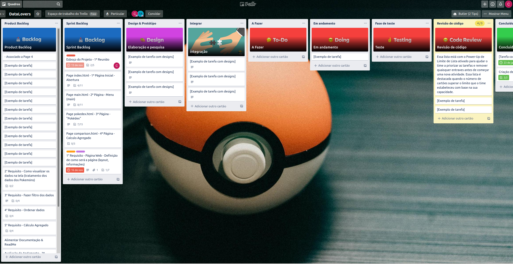
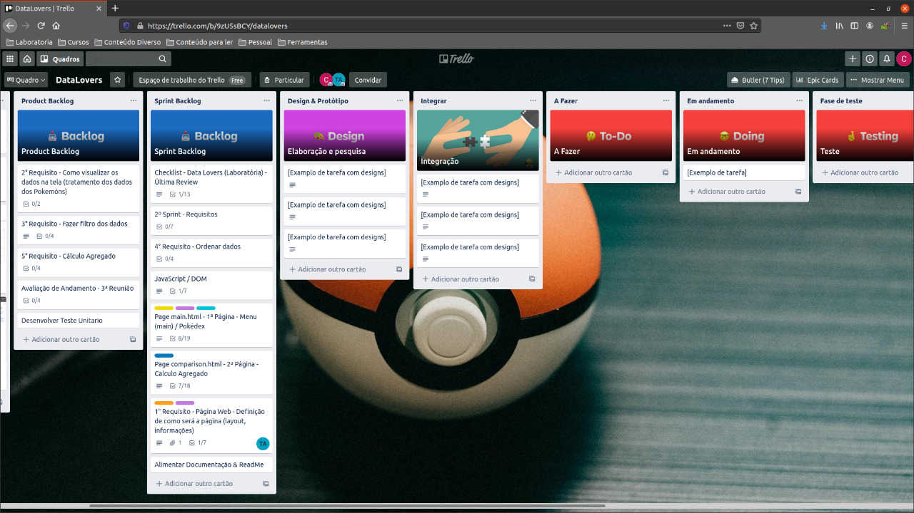

# Data Lovers

## Índice

* [1. Introdução](#1-introdução)
* [2. Processo de Desenvolvimento](#2-resumo-do-projeto)

## 1. Introdução

  O PokeLovers foi desenvolvido pensando em usuários com experiência no [App Pokemon Go](https://pt.wikipedia.org/wiki/Pok%C3%A9mon_GO#:~:text=Niantic%2C%20Inc.,-Compositor(es)&text=Pok%C3%A9mon%20GO%20%C3%A9%20um%20jogo,realidade%20aumentada%20voltado%20para%20smartphones.&text=Foi%2Dlhe%20creditada%20a%20populariza%C3%A7%C3%A3o,e%20movimentando%20os%20neg%C3%B3cios%20locais.)

  A WebPage inicial do PokeLovers dispõe de um Campo para busca individual de PokeCard com informações básicas (Imagem, Nome, Número do Pokémon, Tipo e Resistência), um Painel com informações sobre o PokeLovers a qual é substituído por PokeCards de todos os Pokemons.

## 2. Processo de Desenvolvimento

Inicialmente, procuramos entender o funcionamento do jogo Pokemon Go por meio de pesquisas e leituras que nos possibilitou um maior entendimento da real necessidade dos jogadores.
 	Nesse contexto, desenvolvemos um protótipo de baixa fidelidade (ou MPV) para testar a usabilidade do usuário, para que após essa etapa, desenvolvessemos a interface de alta fidelidade.
 	
 	 Com relação às etapas de desenvolvimento da Aplicação:
 	 
 	 Sprint 1:
	- Planejamento utilizando Trello;
	- Estrutura HTML da Página;
	- Separação de arquivos por pastas;
	- Estilo da Página;
	- Teste de usabilidade com jogadores de Pokemon Go.
	- Lógica da Aplicação utilizando Vanilla Js.
	- Manipulação do DOM;
	- Reformulação do protótipo, com base nos testes realizados.

  ### Planejamento Sprint 1:

  

  ### Review/Retrospectiva da Sprint 1:

  
