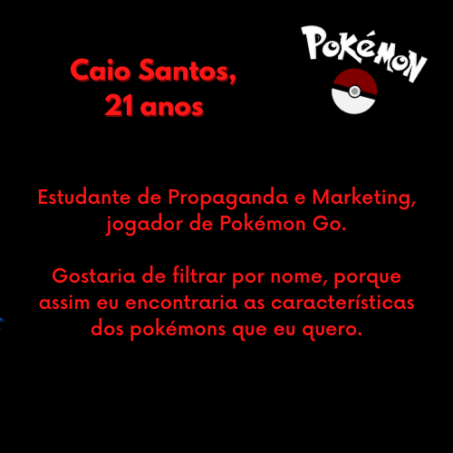
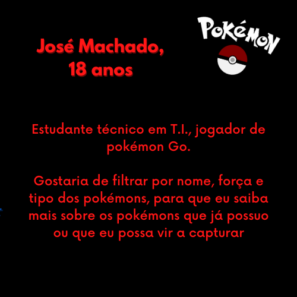
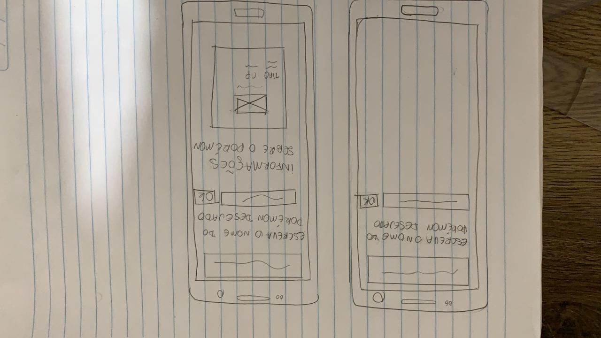
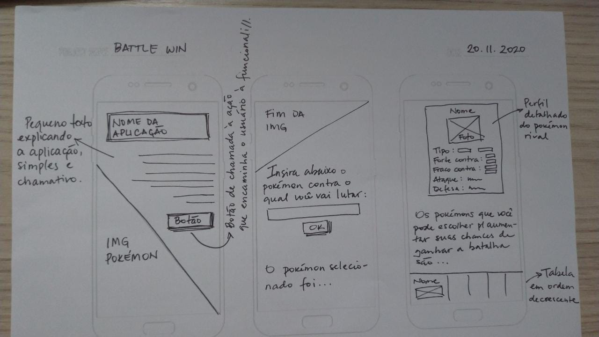
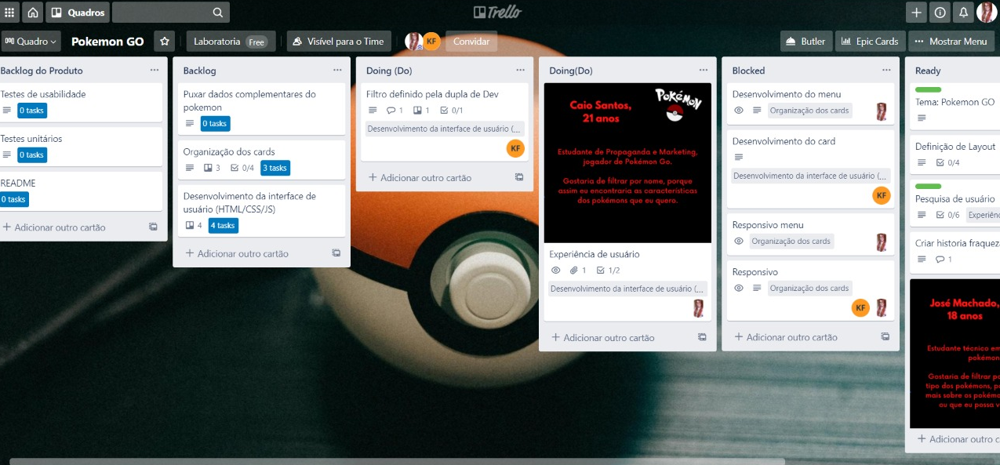
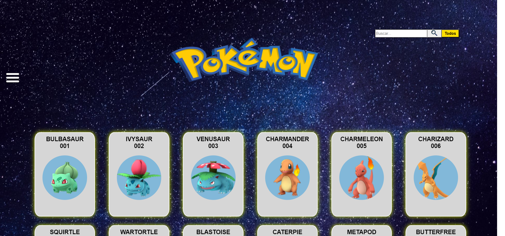
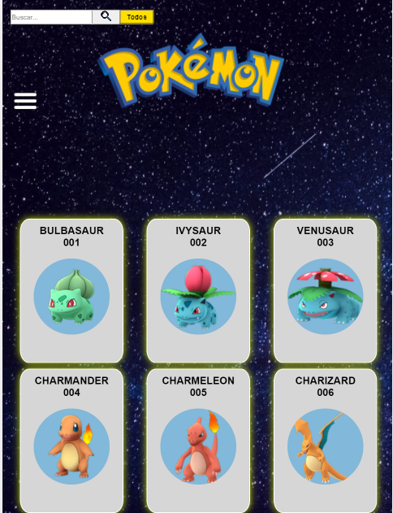
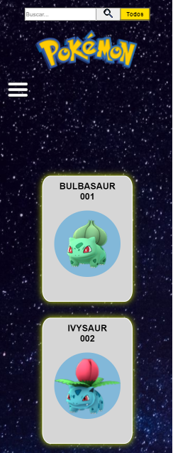

# Pokémon GO

O site desenvolvido em dupla, se trata de uma plataforma de consulta voltado aos usuários do jogo <b>Pokemon Go</b> onde o mesmo pode filtrar informações específicas do pokémon desejado

### Como esse site é util ao meu usuário?

Atravéz da técnica de UX, foram criadas histórias de usuários, onde nelas contém infomações que são utéis ao nosso persona definido.

### Prototipo de baixa fidelidade.

O layout do projeto foi desenvolvido com o intuido da interface ter um menu com filtros do tipo "hamburguer" ( contendo: força, fraqueza, tipos, ordem alfabética e ordem de pokedex), cards com frente (contendo: imagens dos pokémons, nome, número da pokedex,) e com verso (contendo: informações do tipo, altura, peso e se possui ovos), imagem de logo fiel as cores originais do jogo e barra de pesquisa por nome.

### Método de organização do projeto.

Primeiro definimos o layout/cores e como sua interface deveria ser entregue, após definida, com base nessas infomações determinamos o tempo de entrega da tarefa concluída para a atual sprint. Nosso método de organização, se deu atravéz da ferramenta Trello, onde separamos cada tarefa para sua respectiva desenvolvedora.

### Teste de usabilidade.

Após realizarmos o teste de usabilidade com nossos usuários, identificamos os seguintes pontos de melhorias:

* _A barra de pesquisa por nome,caso as letras fossem  todas ou iniciadas em maiusculo, não retornava "pokémon não encontrado"._

* _A informação do cálculo (cálculo agregado) da média de ataque do tipo escolhido, aparece atrás do menu quando a tela é abaixo de 500px. Tendo o usuário que fechar o menu para ler a informação._

* _Limpeza do input após o click do botão "Todos"._

* _Elemento de fraqueza no verso do card era uma informação dispensável_.

### Entrega do site.

Ao final, temos a seguinte interface em todos os tamanhos no método responsivo

_<b>Desktop</b>_

_<b>Tablet</b>_

_<b>Celular</b>_

### Ferramentas utilizadas:

 * _<b>JavaScript</b>_
 * _<b>HTML</b>_
* _<b>CSS</b>_

