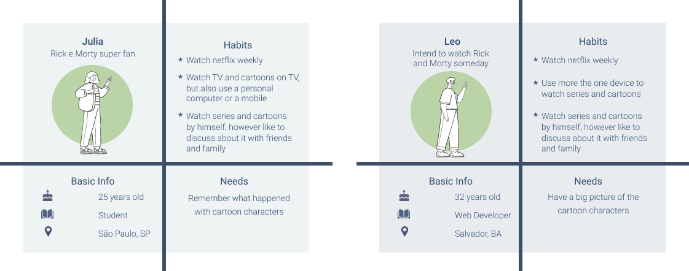
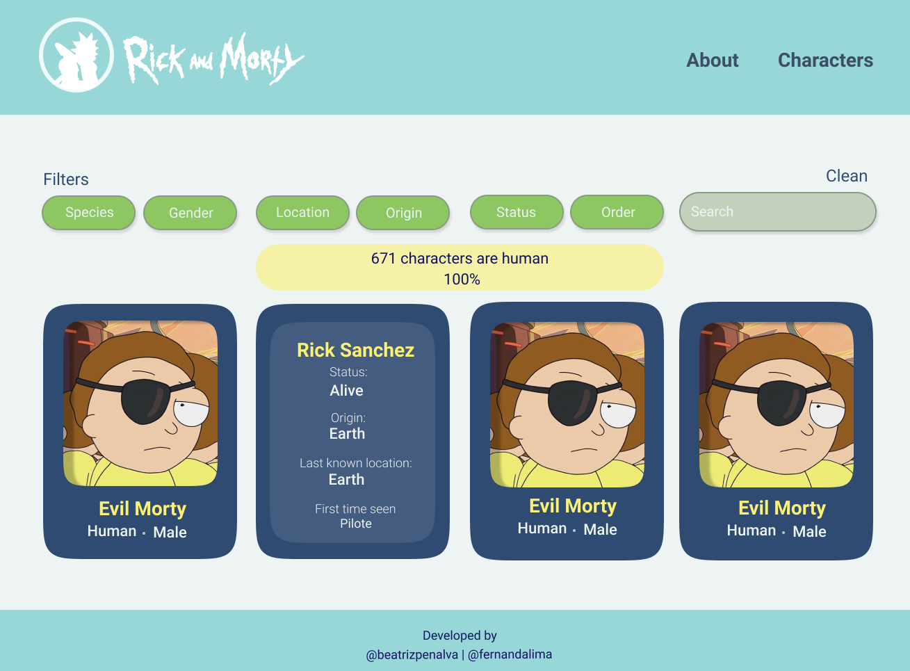
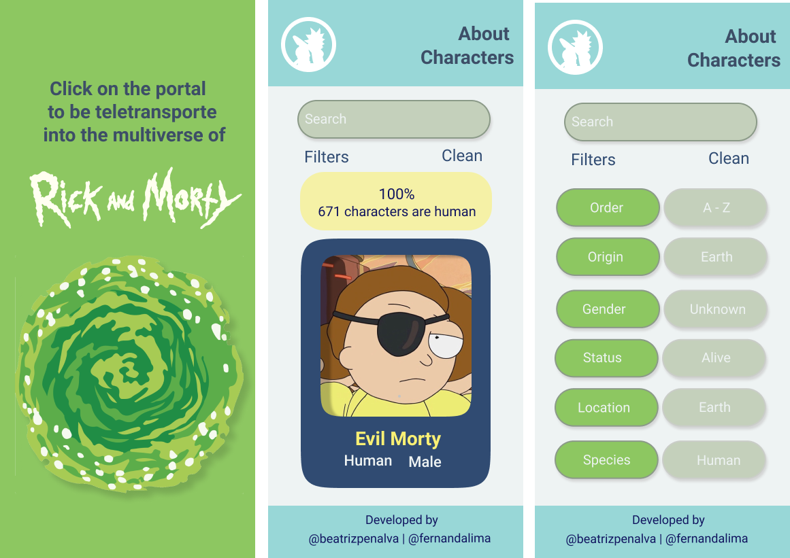

## Rick and Morty Dashboard

An app for fans and curious to venture through a dashboard about Ricky and Morty

## Index

* [About](#about)
* [User Experience](#user-experience)
* [User Interface](#user-interface)
* [Build With](#build-with)
* [Acknowledgments and Credits](#acknowledgments-and-credits)
* [Authors](#authors)

## About
Rick and Morty is a cartoon about the ventures through crazy time-space travels and parallel universes starring Rick Sanchez,  a brilliant scientist, and his (not so smart) grandson, Morty Smith. (Netflix)

*“The universe is a crazy and chaotic place, Morty!”*

The show has 4 seasons, 41 episodes and 671 characters until now. Besides the countless characters, they live in different places, are from multiple universes, from several species and some of them are dead (this is not a spoiler). So, that is a lot of data to assimilate and the time distance between the seasons makes it harder to remember. 

*“Wubba lubba dub dub!”* 

That said, this Dashboard was made to help fans to get information about people and not humans of Rick and Morty’s multiverse. 

## User Experience

***
**Personas**

## User Interface
*"Sometimes science is more art than science."*

The dashboard aesthetic was based on the cartoon's color palette, mostly on the clothes of the two main characters, and we use cards to organize the data based on the quiz results. Besides that, we incorporate user's suggestions in our interface, as use quotes and remarkable symbols of the story. 

The interface was conceived to be responsive since our users use more than one device to watch the series and probably will use our app to discuss with friends and family about the cartoon. We did not make a screen for tablets, because our users do not use this device, so we choose to prioritize the most used devices. 

***
**Desktop Low Fidelity Prototype**

***
**Mobile Low Fidelity Prototype**

## Build With 
* HTML5
* CSS3
* Vanilla JavaScript

## Acknowledgments and Credits
* [Laboratoria](https://www.laboratoria.la/)
* [Rick and Morty API](https://rickandmortyapi.com/)

## Authors
* Beatriz Penalva | [@beatrizpenalva](https://github.com/beatrizpenalva) 
* Fernanda Lima | [@fernadalima](https://github.com/Fernandapy/)
