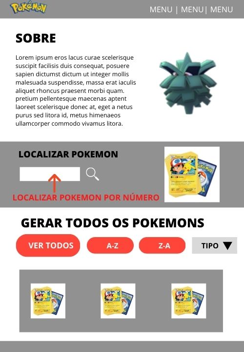

# Data Lovers

## Índice

* [1. Introdução](#1-introdução)
* [2. Histórias do Usuário](#2-histórias-do-usuário)
* [3. Processo de Desenvolvimento](#3-processo-de-desenvolvimento)
* [4. Tutorial Pokelovers](#4-tutorial-pokelovers)

## 1. Introdução

  Desenvolvido em 2020, durante o Bootcamp de Front-End (promovido pela Laboratória-BR),  PokeLovers é um site para jogadores com experiência no [App Pokemon Go](https://pt.wikipedia.org/wiki/Pok%C3%A9mon_GO#:~:text=Niantic%2C%20Inc.,-Compositor(es)&text=Pok%C3%A9mon%20GO%20%C3%A9%20um%20jogo,realidade%20aumentada%20voltado%20para%20smartphones.&text=Foi%2Dlhe%20creditada%20a%20populariza%C3%A7%C3%A3o,e%20movimentando%20os%20neg%C3%B3cios%20locais.).

  Com uma interface intuitiva e projetada tanto para desktop quanto para dispositivos móveis, na aplicação é possível que o usuário localize informações sobre Pokemons, filtre e ordene os dados apresentados, de acordo com suas necessidades.
  
  
## 2. Histórias do Usuário
  
  De acordo com as pesquisas levantadas, foi possível constatar as seguintes necessidades dos Usuários de Pokemon GO:
  
  -Realizar buscas de Pokemons específicos (Pokecard), no qual é possível visualizar as informações dos Pokemons;
  
  - Gerar uma lista completa dos Pokemons, na qual seja possível ordená-la;
  
  -Filtrar Pokemons por tipo e saber a porcentagem desse tipo com relação ao total de Pokemons.
  
  Nesse sentido, são histórias de usuário da aplicação:
  
  
  ### "Eu, como jogador de Pokemon Go, gostaria de poder localizar um Pokemon e ter acesso à um resumo de suas características" ;
  
  #### Solução:
  
 
  
  
  
  ### "Eu, como jogador de Pokemon Go, gostaria de ter acesso a uma lista completa de Pokemons e poder ordená-la em ordem crescente (A-Z) e descrecente (Z-A)" ;
  
   #### Solução:
   
   .
   
  
  ### "Eu, como jogador de Pokemon Go, gostaria de uma aplicação que me permitisse filtrar Pokemons por tipo e saber qual a porcentagem desse tipo com relação ao número total de Pokemons".
  
  #### Solução:
  
  
  

## 3. Processo de Desenvolvimento

Inicialmente, procuramos entender o funcionamento do jogo Pokemon Go por meio de pesquisas e leituras que nos possibilitou um maior entendimento da real necessidade dos jogadores.
Nesse contexto, desenvolvemos um protótipo de baixa fidelidade (ou MPV) para testar a usabilidade do usuário, para que após essa etapa, desenvolvessemos a interface de alta fidelidade.

### Protótipo:

.
 	
Com relação às etapas de desenvolvimento da Aplicação:
   
O projeto foi desenvolvido por meio da Metodologia Scrum. Sendo assim, tivemos três ciclos de entrega (Sprints) nos quais determinamos alguns objetivos:
   
 	 Sprint 1:
	- Planejamento utilizando Trello;
	- Estrutura HTML da Página;
	- Separação de arquivos por pastas;
	- Estilo da Página;
	- Teste de usabilidade com jogadores de Pokemon Go.
	- Gerar lista completa completa de Pokemons (inner.Html);
	- Reformulação do protótipo, com base nos testes realizados.

	 Sprint 2:
	- Definição do layout final (container onde estão sendo exibidos todos os cards);
	- Finalização da Página Principal HTML/CSS (com responsividade aplicada);
	- Função Ordenar por nome (crescente e decrescente);
	- Filtro por tipo de Pokemon;
 	- Correção de problemas que surgiram no decorrer da Sprint (funções, css);

	 Sprint 3:
	 -Ajustes na semântica do HTML;
	 -Ajustes de CSS;
	 -Desenvolvimento do Cálculo Agregado, que permite saber a porcentagem de determinados tipos de Pokemons;
	 -Desenvolvimento de Testes Unitários;
	 -Deploy do Projeto.

  ## 4. Tutorial Pokelovers

  
