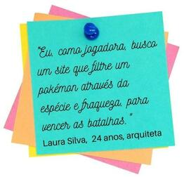
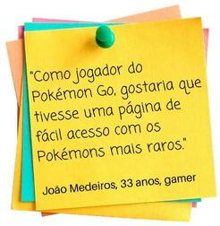
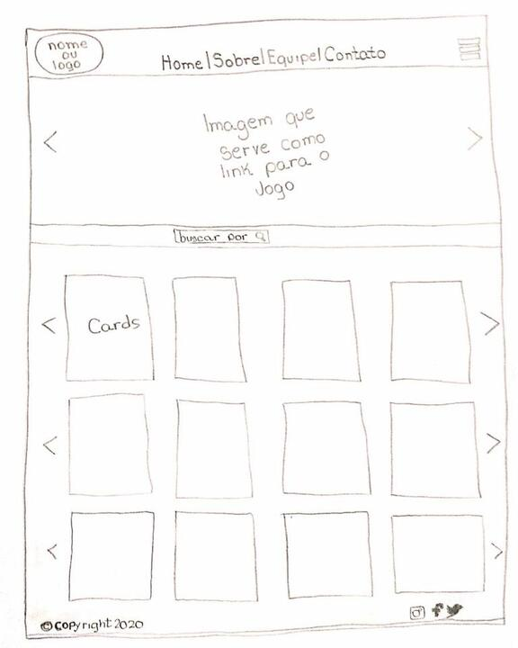
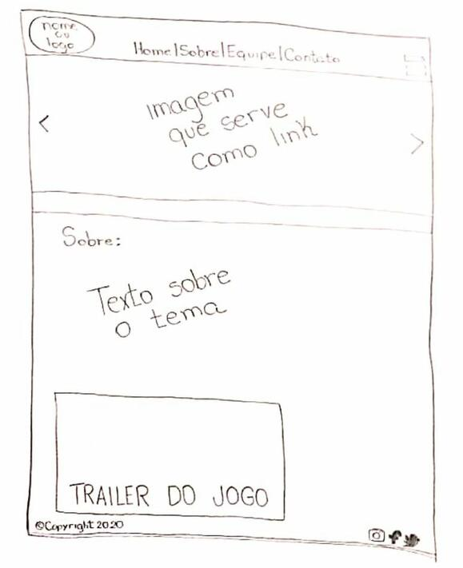
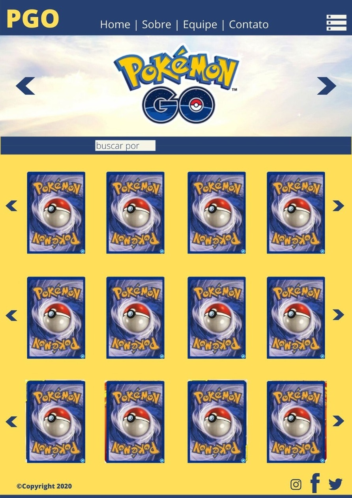
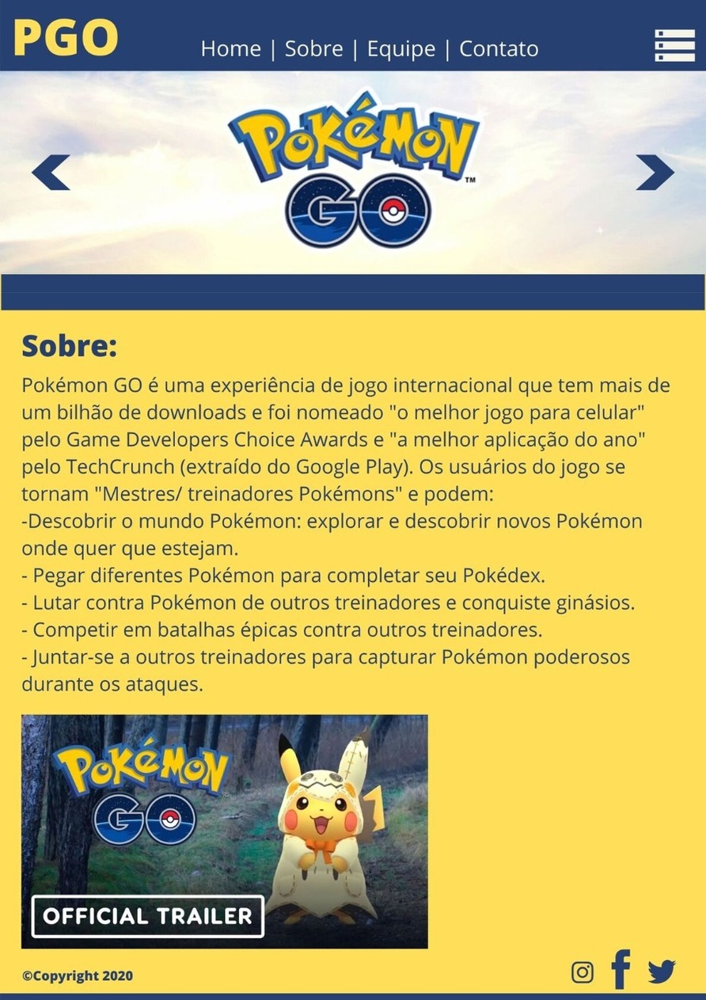
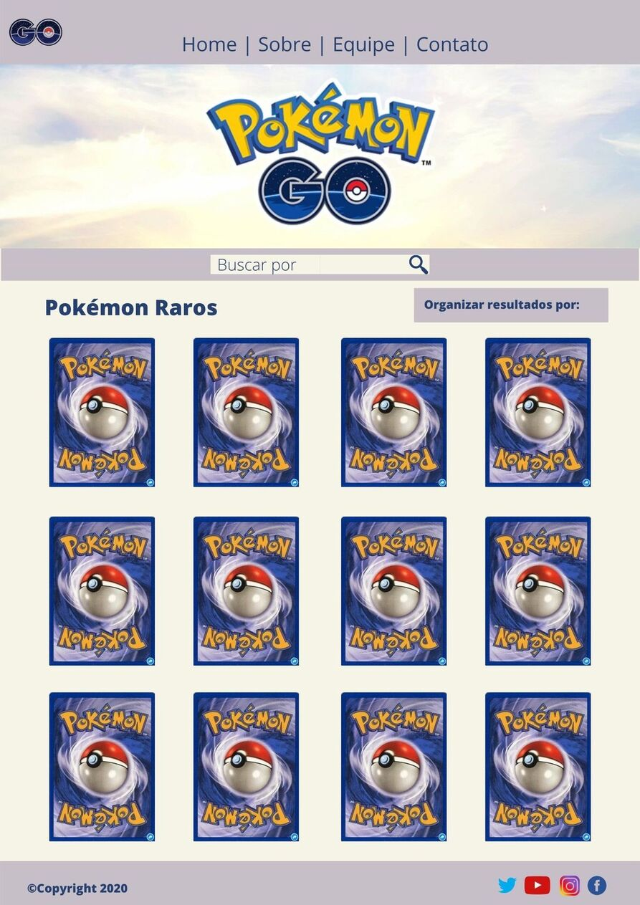

# Pokémon 

 

Pokémon GO é uma experiência de jogo internacional que tem mais de um bilhão de downloads e foi nomeado "o melhor jogo para celular" pelo Game Developers Choice Awards e "a melhor aplicação do ano" pelo TechCrunch (extraído do Google Play). Os usuários do jogo se tornam "Mestres/ treinadores Pokémons" e podem: 

* Descobrir o mundo Pokémon: explorar e descobrir novos Pokémon onde quer que estejam;

* Pegar diferentes Pokémon para completar seu Pokédex;

* Lutar contra Pokémon de outros treinadores e conquiste ginásios; 

* Competir em batalhas épicas contra outros treinadores; 

* Juntar-se a outros treinadores para capturar Pokémon poderosos durante os ataques. 

# História de Usuário 

Entre muitas pesquisas e entrevistas com jogadores de Pokémon, escolhemos o formato Connextra, no qual o usuário escreve em um cartão o seu papel, o que deseja e como iria se beneficiar com isso. Esse modelo induz o usuário a ser claro e objetivo. 

Nas entrevistas, utilizamos post-it e selecionamos dois usuários que pudessem representar as necessidades do grande público de usuários. 

## História do Usuário (1) 

##### Figura1: História do Usuário 1 

## Critérios de Aceitação - Usuário 1 

* Ao acessar o site o usuário já poderá visualizar todos os Pokémons na aba "Home";

* O usuário pode interagir com a interface para obter todas as informações de cada pokémon; 

* O usuário pode clicar no campo "Buscar por" onde receberá opções para filtrar e assim receber uma listagem apenas com seu interesse; 

* O usuário deve selecionar apenas uma das opçôes de filtro que lhe é oferecida;

* Ao selecionar uma opção, o usuário recebe as informações que lhe é necessária através da filtragem;

* O usuário poderá clicar nos cards para ver as informações mais detalhadamente. 

## História do Usuário (2)

##### Figura2: História do Usuário 2 

## Critérios de Aceitação - Usuário 2 

* Ao acessar o site o usuário já poderá visualizar todos os Pokémons raros na página inicial ("Home");

* O usuário pode interagir com a interface para obter todas as informações de cada pokémon raro; 
 
* O usuário pode clicar nos cards para ver as informações mais detalhadamente.

# Definição de Produto 

Definido de acordo com as necessidades pontuadas pelos usuários, sendo assim, foi feito um protótipo inicial para saber se a interface e o estilo estão de acordo. Após as análises e o processo de aprovação, foi elaborado um projeto que lhes traga informações detalhadas de cada Pokémon de forma geral, tendo como opção do usuário escolher se deseja fazer uma filtragem para receber apenas as informações diretas que deseja, sendo a filtragem por nome, tipo (espécie) ou fraqueza. 

# Desenho de Interface do Usuário

## Protótipo de baixa fidelidade

Pensando nas necessidades que surgiram nas entrevistas, foi criado protótipos de baixa fidelidade, para no qual pudesse fazer modificações e melhorias com facilidade. 

 
##### Figura3: Esse protótipo representa a página principal do site denominada como Home. 

##### Figura4: Protótipo do link - Sobre. 

## Protótipo de alta fidelidade 

Criação do protótipo de alta fidelidade, com o objetivo de visualizar melhor todos os detalhes para página web, otimizando as ideias do produto e com intenção de grandes melhorias futura.

##### Figura5: Ideia de protótipo de alta fidelidade na parte do Home.

##### Figura6: Ideia de protótipo de alta fidelidade para o link - Sobre. 

# Teste de Usuabilidade

Durante o processo de desenvolvimento deste produto os usuários pontuaram algumas modificações para a melhoria da interação com a interface. Optaram por um site mais prático e fácil de usar, para que consigam receber seus resultados de pesquisa com mais facilidade.
As resoluções propostas:

* Menu: Retirado, para não se tornar algo repetitivo, já que consta na barra de navegação os links. Onde é mais prático e visível para o usuário acessar;
* Carrossel: Retirado, pois o usuário quer a princípio algo mais objetivo. De entrar na página e já localizar o que quer;
* Cores: Alteração das cores, deixando mais claras de fundo;
* Logos: Alteração de logos para melhor visualização e aprovação do usuário, e acréscimo de redes de sociais;
* Campo para ordenar os dados de pesquisa: Acrescentado, para melhor experiência do usuário;
* Cards raros: Ficará na página home, os usuários terão eles de fácil acesso, sem precisar filtrar.

##### Figura7: 1º teste de Usualibilidade - Home

##### Figura8: 1º teste de Usuabilidade - Sobre

# Autoras

* Alessandra Alves | [Github - Alessandra](https://github.com/ale-alves)
* Larissa Alborghette | [Github - Larissa](https://github.com/laris28)